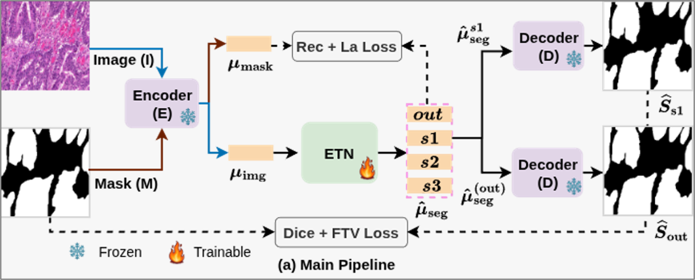

# GET: Generative Embedding Translation for Medical Image Segmentation

This is the official code repository for our paper GET. This guide provides comprehensive instructions for setting up the environment, preparing datasets, and running training and inference.


<!--  -->

---
<p align="center">  </p>

---


## Prerequisites (if only required)

Before you begin, ensure you have the following installed:

- An NVIDIA GPU with a compatible CUDA Toolkit.
- The appropriate NVIDIA drivers for your GPU.
- Conda (or Miniconda) for environment management.

## Installation (you can start from here)

Follow these steps to set up the necessary environment and dependencies.

1. **Create and Activate a Conda Environment**

   ```bash
   # Create a conda environment
   conda env create -f environment.yml

   # Activate the new environment
   conda activate GET
   ```
  > **Note:** If you encounter package conflicts, we recommend creating a fresh environment before proceeding. 


2. **Verify the Installation**

   Run the following command to confirm that PyTorch was installed correctly and can detect your GPU.

   ```bash
   python -c "import torch; print(f'PyTorch Version: {torch.__version__}'); print(f'CUDA Available: {torch.cuda.is_available()}')"
   ```

   The expected output should show your `PyTorch version` and `CUDA Available: True`. If it returns `False`, please verify your NVIDIA driver and CUDA Toolkit installation.

## Dataset Preparation

- **BUS**: Breast Ultrasound Dataset. Download from [MMU Docm](http://www2.docm.mmu.ac.uk/STAFF/M.Yap/dataset.php) (Yap et al.)  
- **BUSI**: Breast Ultrasound Images Dataset. Download from [CU Scholar](https://scholar.cu.edu.eg/?q=afahmy/pages/dataset) (Al-Dhabyani et al.)  
- **GlaS**: Gland Segmentation Challenge Dataset. Download from [Warwick](https://warwick.ac.uk/fac/cross_fac/tia/data/glascontest/) (Sirinukunwattana et al.) OR [Another link](https://academictorrents.com/details/208814dd113c2b0a242e74e832ccac28fcff74e5) 
- **HAM10000**: Skin Lesion Analysis Dataset. Download from [Harvard Dataverse](https://doi.org/10.7910/DVN/DBW86T) (Tschandl et al.)  
- **Kvasir-Instrument**: Endoscopic Instrument Dataset. Download from [Simula Data](https://datasets.simula.no/kvasir-instrument/) (Jha et al.)  

The expected directory structure is as follows:

```
Dataset/
├── bus/
│   ├── bus_train_test_names.pkl      # Defines train/test splits
│   ├── images/
│   └── masks/
├── busi/
│   ├── busi_train_test_names.pkl
│   ├── images/
│   └── masks/
├── glas/
│   ├── glas_train_test_names.pkl
│   ├── images/
│   └── masks/
├── ham10000/
│   ├── ham10000_train_test_names.pkl
│   ├── images/
│   └── masks/
└── kvasir-instrument/
    ├── kvasir_train_test_names.pkl
    ├── images/
    └── masks/
```

You can inspect the predefined training and testing splits using our helper script:

```bash
python Dataset/show_pkl_content.py
```

## Training & Inference

### Training

To train the GET model on a dataset select which one you are going to train from `train.sh`, then run the training script:

```bash
sh train.sh
```

- Model checkpoints and logs will be saved to the `Results/` directory.
- Hyperparameters such as batch size, learning rate, and epochs can be modified in the corresponding YAML configuration files located in `configs/` (e.g., `configs/bus_train.yaml`).

> **Hardware Note:** The default batch size is set to `8`, which is optimized for a 24GB GPU like the NVIDIA 3090 Ti. If you encounter an out-of-memory (OOM) error, please reduce the `batch_size` in the configuration file.

### Inference

To evaluate a trained model and generate segmentation masks, put the trained model into the `valid_dataset_name` (e.g., valid_bus, valid_busi) folder and do other configurations (e.g., `configs/bus_valid.yaml`) like training, then run the validation script:

```bash
sh valid.sh
```

This will produce the following outputs:

- **Predicted Masks:** Saved in the `Results/valid_dataset_name` (e.g., Results/valid_bus) directory.
- **Evaluation Metrics:** A `results.csv` file containing Dice Score (DSC), Intersection over Union (IoU), and 95% Hausdorff Distance (HD95) for each test image.

## Acknowledgements

This work builds upon several outstanding open-source projects. We gratefully acknowledge:

- **Stable Diffusion VAE:** The pretrained Variational Autoencoder from [Stability-AI](https://github.com/stability-ai/stablediffusion).
- **GSS:** The benchmarking utilities for medical image segmentation.

Enjoy the Training and Testing of our GET model. If you encounter any issues, please feel free to open an issue on GitHub.

